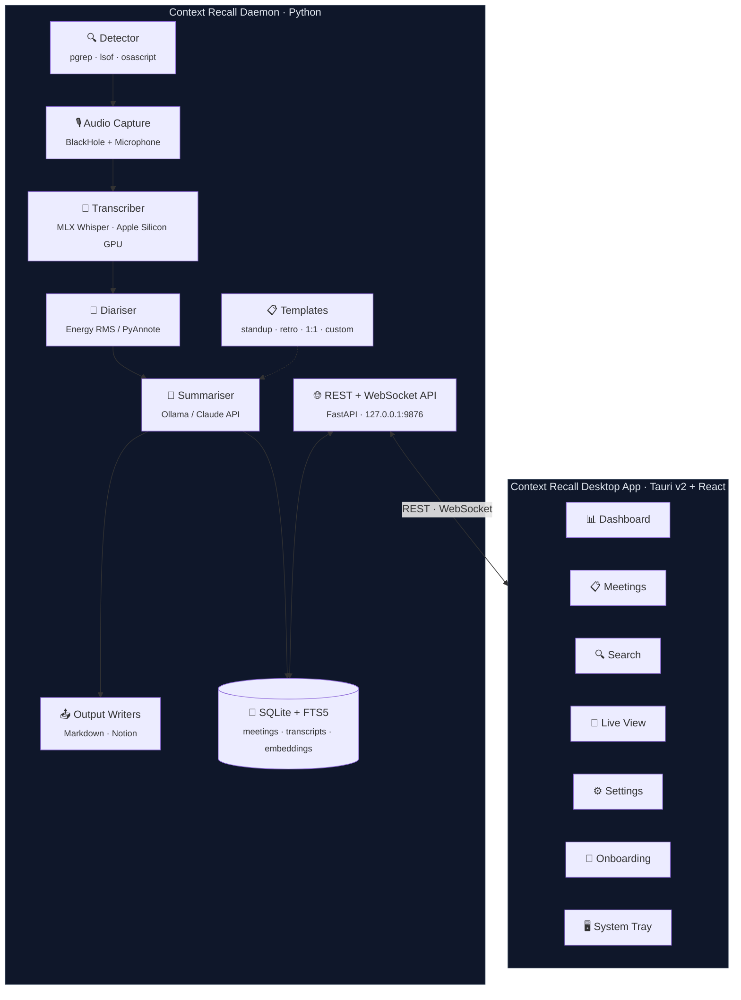
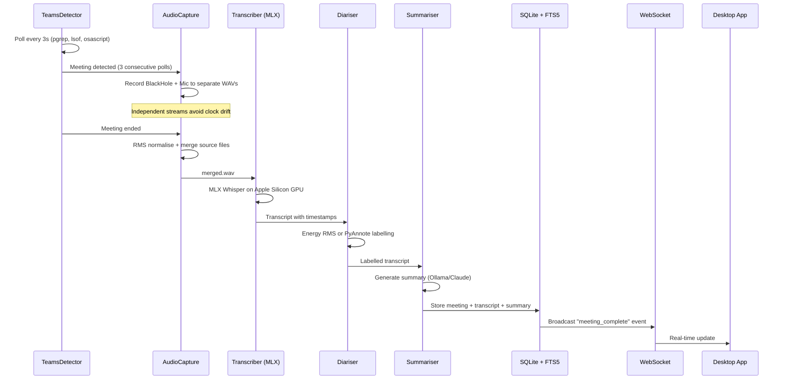
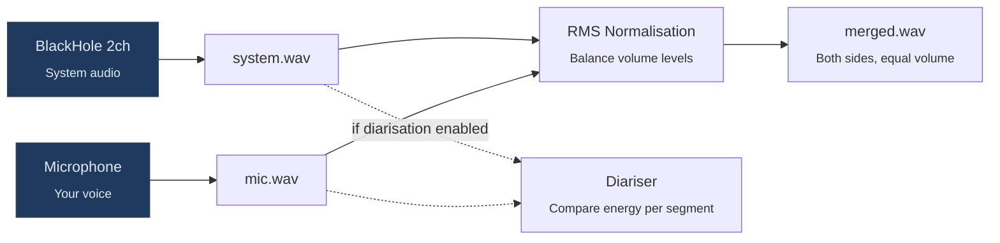

<p align="center">
  
</p>

<h1 align="center">Context Recall</h1>

<p align="center">
  <strong>Context Recall is a local-first macOS meeting assistant that captures configured local audio sources, transcribes meetings with MLX Whisper, stores transcripts locally, and helps users recall decisions, action items, and context from previous meetings.</strong>
</p>

<p align="center">
  
  
  
  
  
  
  
</p>

<p align="center">
  <a href="#features">Features</a> ·
  <a href="#how-it-works">How it works</a> ·
  <a href="#screenshots">Screenshots</a> ·
  <a href="#getting-started">Getting started</a> ·
  <a href="#usage">Usage</a> ·
  <a href="#configuration">Configuration</a> ·
  <a href="#api-reference">API</a> ·
  <a href="#development">Development</a> ·
  <a href="#roadmap">Roadmap</a>
</p>

---


---

## Overview

Context Recall is a local-first macOS meeting assistant. With user-controlled capture configured, it watches for active Teams calls and records the audio sources you have set up (remote participants via system audio loopback and your voice via the microphone), then runs the recording through on-device speech-to-text and an AI summariser to produce structured notes with action items, decisions, and key topics.

Everything runs locally on your Mac. No cloud transcription, no bots joining calls, no data leaving your machine (unless you opt into the Claude API for summarisation). Recordings are intended for consented meetings only; see the legal note below.

### Output Formats

| Format               | Description                                                                |
| -------------------- | -------------------------------------------------------------------------- |
| **Markdown**         | Obsidian-compatible `.md` files with YAML frontmatter (Dataview-queryable) |
| **Notion**           | Native database pages with headings, bullets, and to-do items              |
| **JSON / Clipboard** | Export any meeting via the API or desktop app                              |

### Summarisation Backends

| Backend        | Cost        | Privacy                      | Quality                 |
| -------------- | ----------- | ---------------------------- | ----------------------- |
| **Ollama**     | Free        | Fully local                  | Good (depends on model) |
| **Claude API** | API credits | Transcript sent to Anthropic | Excellent               |

---

## How It Works



### Request Lifecycle



---

## Privacy and Consent

Context Recall is local-first and user-controlled. It captures only the audio sources you have configured (your system output via a loopback driver such as BlackHole, plus your microphone) and processes the recording entirely on your Mac. There is no bot, no Teams API integration, and no audio leaves the machine (unless you opt into the Claude API for summarisation).

Because this is a privacy-conscious meeting recall tool rather than a Teams-integrated recorder, recordings should only be made for meetings where the participants have given consent.

> [!IMPORTANT]
> Recording meetings has legal implications that vary by jurisdiction. Many regions operate under "one-party consent" laws; others require all-party consent. You are responsible for obtaining appropriate consent and for complying with the laws and policies that apply to you and the other participants. Use Context Recall only for consented recordings.

---

## Screenshots

<table>
  <tr>
    <td align="center" valign="top" width="50%">
      
      <br />
      <sub><b>Meeting History</b> — browse, filter, label, and full-text search across every recorded meeting, transcript, and summary.</sub>
    </td>
    <td align="center" valign="top" width="50%">
      
      <br />
      <sub><b>Live View</b> — real-time audio meters, pipeline progress, streaming transcript, and waveform playback with click-to-seek.</sub>
    </td>
  </tr>
  <tr>
    <td align="center" valign="top" width="50%">
      
      <br />
      <sub><b>General Settings</b> — audio devices, meeting detection, diarisation backend, and export paths — no YAML editing required.</sub>
    </td>
    <td align="center" valign="top" width="50%">
      
      <br />
      <sub><b>Advanced Settings</b> — MLX Whisper models, summarisation backend (Ollama or Claude), templates, and Notion integration.</sub>
    </td>
  </tr>
</table>

---

## Features

### Desktop App

- **Native macOS app** — Tauri v2 desktop shell with system tray, dark/light themes, and native notifications
- **Meeting history** — Browse, search, filter, and label all recorded meetings with full-text search (FTS5)
- **Semantic search** — Vector-based search across transcripts using sentence-transformers embeddings
- **Live view** — Real-time audio level meters, pipeline progress, and streaming transcript during recording
- **Audio player** — Waveform visualisation with playback controls, speed adjustment, and click-to-seek from transcript
- **Settings UI** — Full configuration through the app — no YAML editing required
- **Command palette** — `⌘K` to quickly search meetings, start recording, or jump to settings
- **Onboarding wizard** — Guided setup for BlackHole, audio devices, permissions, and model downloads
- **Model management** — Download and manage MLX Whisper models with real-time progress tracking
- **Summary templates** — Built-in templates (standard, standup, retro, 1:1, client-call) plus custom templates
- **Meeting merge** — Combine split meetings that were recorded as separate sessions
- **Speaker management** — Rename speaker labels across meetings
- **Export** — Export meetings as Markdown, JSON, or copy to clipboard
- **Auto-updates** — Built-in update checking via GitHub Releases
- **Accessible** — WCAG AA compliant with full keyboard navigation and screen reader support

### Pipeline

- **Automatic detection** — Monitors macOS process state and audio device usage with debounce to detect live Teams calls without manual intervention or false positives
- **Dual-source audio** — Records system audio (remote participants) and microphone (your voice) to separate files, then merges with RMS normalisation so both sides are equally audible
- **Apple Silicon GPU transcription** — Uses [MLX Whisper](https://github.com/ml-explore/mlx-examples/tree/main/whisper) for ~10x faster on-device speech-to-text via the MLX framework
- **Speaker diarisation** — Two backends: energy-based RMS comparison (no ML, zero dependencies) or [PyAnnote](https://github.com/pyannote/pyannote-audio) (ML-based, multi-speaker, requires torch)
- **AI summarisation** — Produces structured summaries with title, key decisions, detailed action items (with owners, deadlines, subtasks), open questions, and topic tags
- **Summary templates** — User-definable prompts for different meeting types (standups, retros, 1:1s, client calls)
- **Reprocessing** — Re-run transcription and summarisation on any meeting from its existing audio file
- **Data retention** — Configurable auto-cleanup of old audio files and meeting records

### Output

- **Obsidian integration** — Markdown output with YAML frontmatter designed for Obsidian Dataview queries
- **Notion integration** — Creates native Notion database pages with proper headings, bullets, and to-do blocks
- **Export** — Export meetings as Markdown, JSON, or copy to clipboard from the desktop app or API

---

## Audio Pipeline

Context Recall records system audio and microphone to **separate WAV files** using independent audio streams, then merges them after capture with RMS normalisation.



**Why separate files?**

| Reason                     | Explanation                                                                                                                                                    |
| -------------------------- | -------------------------------------------------------------------------------------------------------------------------------------------------------------- |
| **Eliminates clock drift** | Two hardware devices (e.g. BlackHole + USB headset) run on independent clocks. Real-time mixing causes progressive desync. Separate files avoid this entirely. |
| **Balances volume**        | System audio is typically much quieter than a close-range mic. Post-capture normalisation brings both to the same RMS level.                                   |
| **Enables diarisation**    | The separate source files allow energy comparison to determine who was speaking in each segment.                                                               |

---

## Speaker Diarisation

Context Recall supports two diarisation backends:

### Energy-based (default)

Zero dependencies. Compares RMS energy between system audio and microphone per transcript segment:

- Mic significantly louder → **"Me"** (you were speaking)
- System significantly louder → **"Remote"** (another participant)
- Both similar → **"Me + Remote"** (crosstalk)

### PyAnnote (optional)

ML-based speaker diarisation via [pyannote.audio](https://github.com/pyannote/pyannote-audio). Requires `torch` and a HuggingFace token. Distinguishes multiple remote speakers by voice characteristics.

```
[00:01:23] [Remote] So the quarterly numbers show a 15% increase...
[00:01:45] [Me] Right, and I think we should focus on the enterprise segment.
[00:02:10] [Remote] Agreed. Let's draft the proposal by Friday.
```

> [!TIP]
> Diarisation works best with headsets that isolate your mic from system audio. Open speakers cause crosstalk and reduce accuracy.

---

## Getting Started

### Prerequisites

| Requirement               | Purpose                                | Install                                                           |
| ------------------------- | -------------------------------------- | ----------------------------------------------------------------- |
| **macOS** (Apple Silicon) | MLX Whisper requires Apple Silicon GPU | —                                                                 |
| **Python 3.11+**          | Daemon runtime                         | `brew install python@3.11`                                        |
| **BlackHole 2ch**         | Virtual audio loopback driver          | `brew install blackhole-2ch`                                      |
| **Ollama** (recommended)  | Free local summarisation               | `brew install ollama`                                             |
| **Node.js 20+**           | Build desktop app (dev only)           | `brew install node`                                               |
| **Rust** (stable)         | Build Tauri shell (dev only)           | `curl --proto '=https' --tlsv1.2 -sSf https://sh.rustup.rs \| sh` |

### 1. BlackHole Setup

BlackHole creates a virtual audio device that captures system audio via loopback.

```bash
brew install blackhole-2ch
```

After installation, create a **Multi-Output Device** in Audio MIDI Setup:

1. Open **Audio MIDI Setup** (Spotlight → "Audio MIDI Setup")
2. Click **+** → **Create Multi-Output Device**
3. Check both your real speakers/headphones **and** BlackHole 2ch
4. Set your real device as the clock source
5. Set this Multi-Output Device as your system output (System Settings → Sound → Output)

> [!IMPORTANT]
> If you use a USB headset or external speakers, also configure **Teams** to use the Multi-Output Device as its speaker output (Teams → Settings → Devices → Speaker). If Teams sends audio directly to your headset, BlackHole won't capture it.

### 2. Ollama (Local AI — Recommended)

```bash
brew install ollama
ollama pull qwen3:30b-a3b    # or llama3.1:8b for lighter hardware
ollama serve
```

> Alternatively, set `backend: "claude"` in config and provide an Anthropic API key.

### 3. Install

```bash
git clone https://github.com/JWhite212/context-recall.git
cd context-recall
python3 -m venv .venv
source .venv/bin/activate
pip install -r requirements.txt
cp config.example.yaml config.yaml   # then edit with your values
```

Or use the Makefile:

```bash
make setup   # Creates venv, installs Python + UI dependencies
```

### 4. Configure

Edit `config.yaml` — the essential settings:

| Setting                           | Description                                  | Default                |
| --------------------------------- | -------------------------------------------- | ---------------------- |
| `summarisation.backend`           | `"ollama"` (free, local) or `"claude"` (API) | `ollama`               |
| `summarisation.ollama_model`      | Ollama model name                            | `qwen3:30b-a3b`        |
| `summarisation.anthropic_api_key` | Anthropic key (Claude backend only)          | —                      |
| `audio.blackhole_device_name`     | BlackHole device name                        | `BlackHole 2ch`        |
| `audio.mic_device_name`           | Microphone (empty = system default)          | `""`                   |
| `diarisation.enabled`             | Label speakers as "Me" / "Remote"            | `false`                |
| `diarisation.backend`             | `"energy"` (no ML) or `"pyannote"` (ML)      | `energy`               |
| `markdown.vault_path`             | Obsidian vault meetings folder               | `~/Documents/Meetings` |

See [`config.example.yaml`](config.example.yaml) for the full reference with all options documented.

---

## Usage

### Daemon Mode (Auto-Detect Meetings)

```bash
python3 -m src.main
```

Polls for active Teams calls and automatically starts/stops recording. Detection uses debounce (3 consecutive positive polls over ~9 seconds) to prevent false positives.

### Manual Recording

```bash
python3 -m src.main --record-now
```

Starts recording immediately without waiting for Teams detection. Press `Ctrl+C` to stop — the recording is then transcribed and summarised.

### Process Existing Audio

```bash
python3 -m src.main --process /path/to/audio.wav
```

Skip recording and run an existing audio file through the full pipeline.

### Desktop App

```bash
make dev     # Start Tauri + Vite dev server
```

Or for production:

```bash
make build   # Build daemon binary + Tauri .app/.dmg
make install # Build + install launch agent
```

### Run as a Launch Agent (Auto-Start on Login)

```bash
cp dev.jamiewhite.contextrecall.agent.plist ~/Library/LaunchAgents/
launchctl load ~/Library/LaunchAgents/dev.jamiewhite.contextrecall.agent.plist
```

---

## Output

### Markdown

Each meeting produces a file like:

```
~/Documents/Meetings/2026-04-08_quarterly-planning-review.md
```

```yaml
---
title: "Quarterly Planning Review"
date: 2026-04-08
time: 14:30
duration_minutes: 45
tags: ["roadmap", "hiring", "q3-planning"]
type: meeting-note
---
```

Followed by the AI-generated summary with sections for:

- **Summary** — High-level overview of what was discussed and why it matters
- **Key Decisions** — Decisions made during the meeting
- **Action Items** — Each item includes full context, owner, deadline, and subtasks
- **Open Questions** — Unresolved topics for follow-up
- **Full Transcript** — Timestamped and speaker-labelled (`[00:01:23] [Remote] So the quarterly numbers...`)

### Notion

A new page is created in your configured Notion database with:

- **Properties:** Title, Date, Tags (multi-select), Status
- **Content:** Native Notion blocks — headings, bullets, and to-do items (not raw Markdown)

---

## Configuration

<details>
<summary><strong>Full config.example.yaml</strong></summary>

```yaml
# Meeting Detection
detection:
  poll_interval_seconds: 3
  min_meeting_duration_seconds: 30
  required_consecutive_detections: 3
  min_gap_before_new_meeting: 60
  process_names:
    - "Microsoft Teams"
    - "MSTeams"
    - "Teams"

# Audio Capture
audio:
  blackhole_device_name: "BlackHole 2ch"
  mic_device_name: ""
  mic_enabled: true
  mic_volume: 1.0
  system_volume: 1.0
  sample_rate: 16000
  channels: 1
  temp_audio_dir: "~/Library/Application Support/Context Recall/audio"
  keep_source_files: false

# Transcription (MLX Whisper — Apple Silicon GPU)
transcription:
  model_size: "mlx-community/whisper-large-v3-turbo"
  language: "en" # "auto" for language detection
  vad_threshold: 0.35

# Summarisation
summarisation:
  backend: "ollama"
  ollama_base_url: "http://localhost:11434"
  ollama_model: "qwen3:30b-a3b"
  ollama_timeout: 600
  ollama_num_ctx: 32768
  anthropic_api_key: "sk-ant-..."
  model: "claude-sonnet-4-20250514"
  max_tokens: 4096
  chunk_threshold_words: 20000
  default_template: "standard" # standard | standup | retro | 1on1 | client-call

# Speaker Diarisation
diarisation:
  enabled: false
  speaker_name: "Me"
  remote_label: "Remote"
  energy_ratio_threshold: 1.5
  backend: "energy" # "energy" or "pyannote"
  pyannote_model: "pyannote/speaker-diarization-3.1"
  num_speakers: 0 # 0 = auto-detect (pyannote)

# Output: Markdown
markdown:
  enabled: true
  vault_path: "~/Documents/Meetings"
  filename_template: "{date}_{slug}.md"
  include_full_transcript: true

# Output: Notion
notion:
  enabled: false
  api_key: "ntn_..."
  database_id: ""
  properties:
    title: "Name"
    date: "Date"
    tags: "Tags"
    status: "Status"

# Data Retention
retention:
  audio_retention_days: 0 # 0 = keep forever
  record_retention_days: 0

# API Server
api:
  enabled: true
  host: "127.0.0.1"
  port: 9876

# Logging
logging:
  level: "INFO"
  log_file: "~/Library/Logs/Context Recall/contextrecall.log"
```

</details>

---

## API Reference

The daemon exposes a REST + WebSocket API at `http://127.0.0.1:9876`. Interactive Swagger docs available at [`/docs`](http://localhost:9876/docs) when running.

All endpoints require HMAC token authentication. The WebSocket uses a message-based auth handshake.

<details>
<summary><strong>Endpoints</strong></summary>

| Method   | Endpoint                            | Description                                   |
| -------- | ----------------------------------- | --------------------------------------------- |
| `GET`    | `/api/health`                       | Health check                                  |
| `GET`    | `/api/status`                       | Daemon state + active meeting info            |
| `GET`    | `/api/meetings`                     | List meetings (paginated, filterable)         |
| `GET`    | `/api/meetings/{id}`                | Get meeting by ID                             |
| `DELETE` | `/api/meetings/{id}`                | Delete meeting and audio                      |
| `GET`    | `/api/meetings/{id}/audio`          | Download meeting audio file                   |
| `PATCH`  | `/api/meetings/{id}/label`          | Set meeting label                             |
| `POST`   | `/api/meetings/merge`               | Merge multiple meetings                       |
| `GET`    | `/api/meetings/labels`              | Get distinct labels                           |
| `POST`   | `/api/meetings/{id}/resummarise`    | Re-summarise with different template          |
| `POST`   | `/api/meetings/{id}/reprocess`      | Reprocess from audio (transcribe + summarise) |
| `POST`   | `/api/record/start`                 | Start recording manually                      |
| `POST`   | `/api/record/stop`                  | Stop recording                                |
| `GET`    | `/api/config`                       | Get current configuration                     |
| `PUT`    | `/api/config`                       | Update configuration                          |
| `GET`    | `/api/devices`                      | List audio input/output devices               |
| `GET`    | `/api/models`                       | List available Whisper models                 |
| `POST`   | `/api/models/download`              | Download a Whisper model                      |
| `POST`   | `/api/search`                       | Full-text + semantic search                   |
| `POST`   | `/api/search/reindex`               | Rebuild search index                          |
| `GET`    | `/api/templates`                    | List summary templates                        |
| `GET`    | `/api/templates/{name}`             | Get template by name                          |
| `POST`   | `/api/templates`                    | Create custom template                        |
| `DELETE` | `/api/templates/{name}`             | Delete custom template                        |
| `PATCH`  | `/api/meetings/{id}/speakers/{sid}` | Rename speaker                                |
| `GET`    | `/api/meetings/{id}/speakers`       | Get speakers for meeting                      |
| `GET`    | `/api/speakers`                     | Get all known speakers                        |
| `POST`   | `/api/export/{id}`                  | Export meeting (Markdown/JSON)                |
| `WS`     | `/ws`                               | Real-time events (meeting updates, progress)  |

</details>

---

## Project Structure

```
context-recall/
├── config.example.yaml              # Config template (tracked)
├── context-recall.spec              # PyInstaller build spec
├── pyproject.toml                   # Project metadata, pytest & ruff config
├── Makefile                         # Build automation (setup, build, test, lint)
├── dev.jamiewhite.contextrecall.agent.plist  # launchd agent for auto-start on login
│
├── src/                             # Python daemon
│   ├── main.py                      # Orchestrator (ContextRecall class)
│   ├── detector.py                  # State machine + debounce logic
│   ├── audio_capture.py             # Dual-source recording + RMS merge
│   ├── transcriber.py               # MLX Whisper speech-to-text
│   ├── diariser.py                  # Energy-based speaker labelling
│   ├── pyannote_diariser.py         # PyAnnote ML-based diarisation
│   ├── summariser.py                # AI summarisation (Ollama / Claude)
│   ├── templates.py                 # Summary template system
│   ├── embeddings.py                # Semantic search (sentence-transformers)
│   ├── platform/
│   │   ├── detector.py              # PlatformDetector protocol + factory
│   │   ├── macos.py                 # macOS detection (pgrep, lsof, osascript)
│   │   ├── linux.py                 # Linux stub
│   │   └── windows.py               # Windows stub
│   ├── api/
│   │   ├── server.py                # FastAPI app + background thread
│   │   ├── auth.py                  # HMAC token authentication
│   │   ├── schemas.py               # Pydantic response models
│   │   ├── events.py                # EventBus (sync/async pub-sub)
│   │   ├── websocket.py             # WebSocket connection manager
│   │   └── routes/                  # 14 route modules (see API Reference)
│   ├── db/
│   │   ├── database.py              # SQLite + FTS5 schema + migrations
│   │   └── repository.py            # Meeting CRUD, search, retention cleanup
│   ├── output/
│   │   ├── markdown_writer.py       # Obsidian-compatible .md output
│   │   └── notion_writer.py         # Notion database page output
│   └── utils/
│       └── config.py                # YAML config → typed dataclasses
│
├── ui/                              # Tauri v2 + React desktop app
│   ├── src/
│   │   ├── App.tsx                  # Router + layout
│   │   ├── components/
│   │   │   ├── dashboard/           # Stats, recent meetings, quick actions
│   │   │   ├── meetings/            # MeetingList, MeetingDetail, AudioPlayer
│   │   │   ├── search/              # Full-text + semantic search UI
│   │   │   ├── live/                # Real-time transcript + audio meters
│   │   │   ├── settings/            # All config sections
│   │   │   ├── onboarding/          # Setup wizard (permissions, devices, models)
│   │   │   ├── layout/              # Sidebar navigation
│   │   │   └── common/              # Toast, Skeleton, Tooltip, CommandPalette
│   │   ├── hooks/                   # useDaemonStatus, useWebSocket, useTheme
│   │   ├── stores/                  # Zustand state management
│   │   └── lib/                     # API client, types, constants
│   └── src-tauri/
│       ├── src/lib.rs               # Tauri commands (auth, updates, daemon)
│       ├── src/tray.rs              # System tray with dynamic menu
│       └── tauri.conf.json          # App config, bundling, updater
│
├── tests/                           # 31 test files, ~5700 lines
│   ├── conftest.py                  # Shared fixtures (tmp DB, config, EventBus)
│   ├── test_api*.py                 # API integration tests (11 files)
│   ├── test_repository.py           # Meeting CRUD, search, retention
│   ├── test_config*.py              # Config loading, validation, edge cases
│   ├── test_detector.py             # State machine transitions
│   ├── test_summariser.py           # Both backends
│   ├── test_templates.py            # Template CRUD + built-ins
│   ├── test_embeddings.py           # Semantic search
│   └── ...                          # Audio, diarisation, platform, orchestrator
│
├── scripts/
│   ├── build_daemon.sh              # PyInstaller daemon binary
│   ├── install.sh                   # Build + install launch agent
│   ├── create_dmg.sh               # Create macOS .dmg installer
│   ├── bump_version.sh              # Sync version across all manifests
│   └── generate_icons.py            # Generate app icons from source
│
└── .github/workflows/
    ├── test.yml                     # CI: ruff lint + pytest + TypeScript check
    └── release.yml                  # CD: build daemon → build app → GitHub Release
```

---

## Tech Stack

| Layer                | Technology                                                                                                                  |
| -------------------- | --------------------------------------------------------------------------------------------------------------------------- |
| **Desktop app**      | [Tauri v2](https://v2.tauri.app/) (Rust) + [React 18](https://react.dev/) + [TypeScript 5](https://www.typescriptlang.org/) |
| **Styling**          | [Tailwind CSS](https://tailwindcss.com/)                                                                                    |
| **State management** | [Zustand](https://zustand.docs.pmnd.rs/) + [React Query](https://tanstack.com/query)                                        |
| **Animations**       | [Framer Motion](https://www.framer.com/motion/)                                                                             |
| **Daemon API**       | [FastAPI](https://fastapi.tiangolo.com/) + WebSocket                                                                        |
| **Database**         | SQLite + FTS5 (via [aiosqlite](https://github.com/omnilib/aiosqlite))                                                       |
| **Audio capture**    | [sounddevice](https://python-sounddevice.readthedocs.io/) + [BlackHole](https://existential.audio/blackhole/)               |
| **Transcription**    | [MLX Whisper](https://github.com/ml-explore/mlx-examples/tree/main/whisper) (Apple Silicon GPU)                             |
| **Embeddings**       | [sentence-transformers](https://www.sbert.net/) (all-MiniLM-L6-v2)                                                          |
| **Summarisation**    | [Ollama](https://ollama.com/) or [Claude API](https://docs.anthropic.com/)                                                  |
| **Diarisation**      | Energy-based RMS (numpy) or [PyAnnote](https://github.com/pyannote/pyannote-audio)                                          |
| **Packaging**        | [PyInstaller](https://pyinstaller.org/) (daemon binary) + Tauri bundler (.app/.dmg)                                         |
| **CI/CD**            | GitHub Actions (lint, test, build, release)                                                                                 |
| **Platform**         | macOS Apple Silicon                                                                                                         |

---

## Development

### Quick Start

```bash
make setup   # Create venv, install all dependencies
make dev     # Start Tauri + Vite dev server with hot-reload
```

### Backend (Daemon)

```bash
source .venv/bin/activate
python3 -m src.main           # Run daemon

make test                     # Run pytest suite (31 test files)
make lint                     # Run ruff linter
make typecheck-python         # Run Pyright (config in pyproject.toml)
```

`make typecheck-python` runs [Pyright](https://microsoft.github.io/pyright/)
in `basic` mode against `src/`. The configuration lives under
`[tool.pyright]` in `pyproject.toml`. This is currently a soft baseline:
findings are reported but do not fail CI yet, and the gate will be
tightened over time.

### Frontend (Desktop App)

```bash
cd ui
npm install
npm run tauri dev             # Dev mode with hot-reload
npx tsc --noEmit              # Type check
```

### Build for Distribution

```bash
make build                    # Build daemon binary + Tauri .app/.dmg
make install                  # Build + install launch agent

# Or step by step:
./scripts/build_daemon.sh     # PyInstaller → dist/context-recall-daemon/
cd ui && npm run tauri build  # Tauri → .app + .dmg
```

### Version Bumping

```bash
./scripts/bump_version.sh 0.2.0
# Updates tauri.conf.json, Cargo.toml, and package.json
```

### API Documentation

The daemon serves interactive Swagger UI at [`http://localhost:9876/docs`](http://localhost:9876/docs) when running.

---

## Troubleshooting

<details>
<summary><strong>No audio captured (silent recording)</strong></summary>

1. Verify BlackHole is installed: `brew list blackhole-2ch`
2. Check your system output is set to the Multi-Output Device (not directly to speakers)
3. **Check Teams' speaker setting** — go to Teams → Settings → Devices → Speaker and ensure it's set to "Multi-Output Device" or "System Default"
4. Run `python3 -m sounddevice` to confirm BlackHole appears as an input device
5. Test audio capture:

```bash
python3 -c "
import sounddevice as sd, numpy as np
data = sd.rec(int(3 * 16000), samplerate=16000, channels=2, device='BlackHole 2ch', dtype='float32')
sd.wait()
peak = np.max(np.abs(data))
print(f'Peak amplitude: {peak:.6f}')
print('Signal detected' if peak > 0.001 else 'SILENT — check audio routing')
"
```

</details>

<details>
<summary><strong>VAD removes all audio</strong></summary>

The Whisper VAD filter discards segments classified as silence. If your audio is very quiet, the entire recording may be filtered out. Try lowering `transcription.vad_threshold` in your config (default: `0.35`, lower = less aggressive).

</details>

<details>
<summary><strong>False positive meeting detection</strong></summary>

The detector requires 3 consecutive positive polls (~9 seconds) before triggering. If false positives persist, increase `detection.required_consecutive_detections` in your config.

</details>

<details>
<summary><strong>Ollama connection refused</strong></summary>

Ensure the Ollama server is running (`ollama serve`) and listening on the configured port (default: `http://localhost:11434`).

</details>

<details>
<summary><strong>Diarisation labels are inaccurate</strong></summary>

- Use a headset with good mic isolation. Open speakers cause crosstalk.
- Adjust `diarisation.energy_ratio_threshold` — lower (e.g. `1.2`) is more decisive, higher (e.g. `2.0`) requires bigger energy differences.
- For multi-speaker calls, switch to the `pyannote` backend for voice-characteristic-based labelling.

</details>

---

## Roadmap

Contributions and issue-tracked suggestions welcome.

- [ ] **Windows and Linux support** — platform stubs exist at `src/platform/`. Needs WASAPI loopback (Windows) and PulseAudio/PipeWire monitor sources (Linux).
- [ ] **More meeting platforms** — extend the detector to recognise Zoom, Google Meet, Slack Huddles, and Discord calls.
- [ ] **Speaker name enrichment** — attach real participant names by cross-referencing Teams meeting invitations.
- [ ] **Cross-meeting retrieval** — query across meeting history: _"what did we decide about pricing last quarter?"_
- [ ] **Real-time transcription** — stream transcript to the UI during recording (currently post-capture only).
- [ ] **Calendar integration** — auto-tag meetings with calendar event titles and attendees.

---

## Author

**Jamie White** — early-career software engineer building Context Recall as a personal product focused on local-first, privacy-conscious meeting recall.

<p>
  <a href="https://jamie-white-portfolio.vercel.app">Portfolio</a> ·
  <a href="https://github.com/JWhite212">GitHub</a> ·
  <a href="https://www.linkedin.com/in/jamie-white-swe/">LinkedIn</a>
</p>

Context Recall is a local-first macOS meeting assistant built with a Python daemon, Tauri v2, React, TypeScript, FastAPI, SQLite/FTS5, and MLX Whisper. It captures configured local audio sources for consented meetings, transcribes on-device using Apple Silicon acceleration, and provides searchable meeting history, summaries, action items, and exports.

If you're hiring for a software engineering role and want to discuss how Context Recall was built — from the dual-source audio pipeline to on-device GPU transcription, speaker diarisation, and the Tauri desktop shell — email **jamiecs@live.co.uk**.

## License

Released under the [MIT License](LICENSE).
